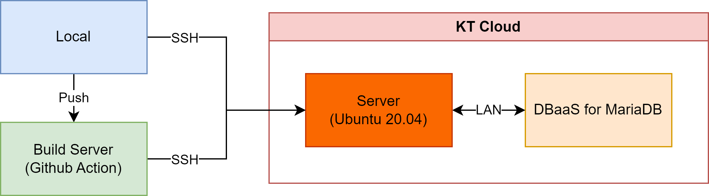
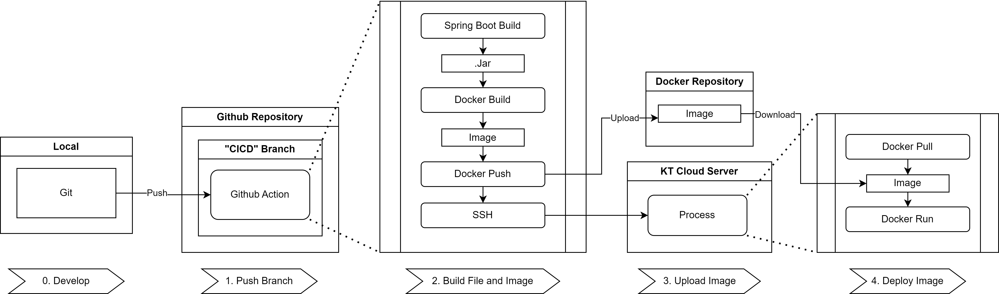

# KT 클라우드 개인 실습

## 개요  
기간 : 2023년 8월 22~25일  
목적 : 클라우드 관련 업무 적응을 위한 간단한 CRUD 및 개인 클라우드 실습  
사용 기술 :  

- Backend
  - Spring Boot
  - Spring Data Jpa

  
- Frontend
  - Thymeleaf
  - AJAX
  
- Server
  - KT Cloud

## 서버 구성

- KT 클라우드를 사용함
- 메인 서버와 데이터베이스 서버로 구성되어 있음

## 배포 자동화 파이프라인

    0. Develop
    1. Push Branch
    2. Build File and Image
    3. Upload Image
    4. Deploy Image

### 0. Develop
- 개발 단계

### 1. Push Branch
- 개발이 끝난 코드를 깃허브 리포지토리의 CICD 브랜치에 직접 Push 혹은 Merge 하면 Github Action이 실행된다.

### 2. Build File and Image
- Github Action은 올려진 브랜치 프로젝트 파일을 빌드하고, 빌드 파일을 Docker Image 파일로 만든다.

### 3. Upload Image
- Image 파일을 Docker Hub에 업로드한다. (비공개 리포지토리에 업로드 함)

### 4. Deploy Image
- Github Action 명령으로 SSH로 KT 클라우드 서버에 접속하여 Docker Image 파일을 가져와서 배포한다.