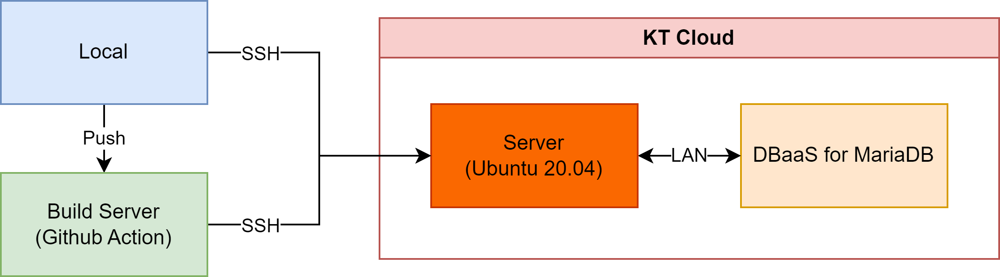
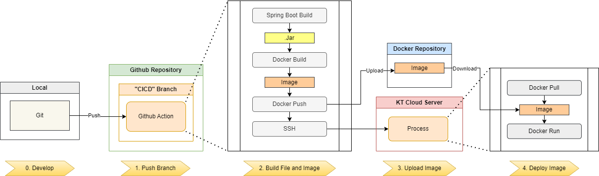
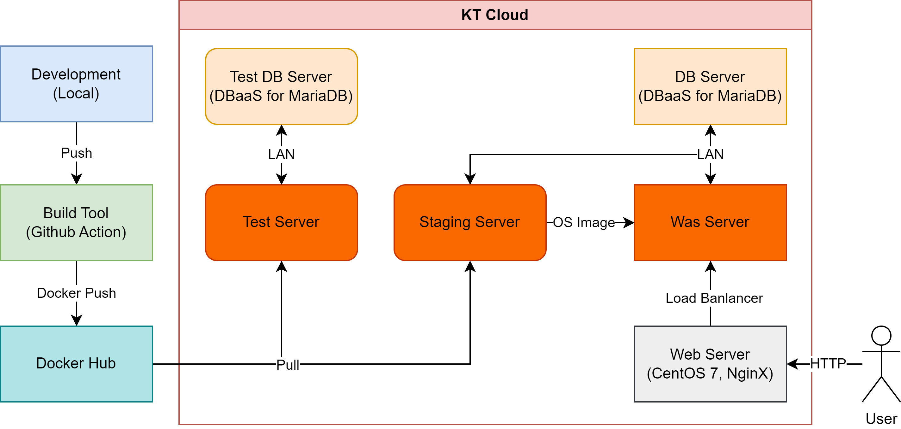
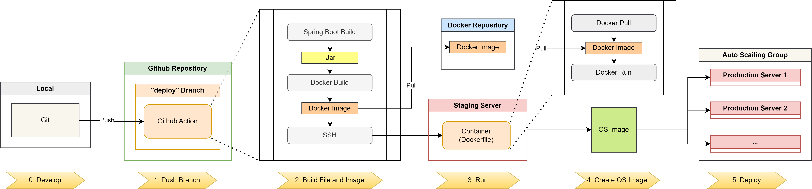

# KT 클라우드 개인 실습

## 개요  
기간 : 2023년 8월 22~25일 (1차), 9월 7~8일 (2차)  
목적 : 클라우드 관련 업무 적응을 위한 간단한 CRUD 및 개인 클라우드 실습  
사용 기술 :  

- Backend
  - Spring Boot
  - Spring Data Jpa

  
- Frontend
  - Thymeleaf
  - AJAX
  
- Server
  - KT Cloud

## 1차

### 서버 구성

- KT 클라우드를 사용함
- 메인 서버와 데이터베이스 서버로 구성되어 있음

### 배포 자동화 파이프라인

    0. Develop
    1. Push Branch
    2. Build File and Image
    3. Upload Image
    4. Deploy Image

#### 0. Develop
- 개발 단계

#### 1. Push Branch
- 개발이 끝난 코드를 깃허브 리포지토리의 CICD 브랜치에 직접 Push 혹은 Merge 하면 Github Action이 실행된다.

#### 2. Build File and Image
- Github Action은 올려진 브랜치 프로젝트 파일을 빌드하고, 빌드 파일을 Docker Image 파일로 만든다.

#### 3. Upload Image
- Image 파일을 Docker Hub에 업로드한다. (비공개 리포지토리에 업로드 함)

#### 4. Deploy Image
- Github Action 명령으로 SSH로 KT 클라우드 서버에 접속하여 Docker Image 파일을 가져와서 배포한다.

 

## 2차

### 개선점
- 개발환경과 배포환경의 분리
- 클라우드의 기술 활용
  - 로드 밸런서
  - 오토 스캐일링

### 서버 구성

- Branch에 push되면 Github Action 과 Docker Hub를 통하여 Test 서버와 Staging 서버에 배포됨
  - Test 서버에서는 실제 환경과 분리된 DB 서버와 연결되어 독자적으로 테스트함
  - Staging 서버에서는 실제 환경의 DB와 연결되어 기존의 서버와 연결되어 돌아갈 수 있는지 확인함.
- 3 Tier 아키텍처(Web, WAS, DB)를 구성하여 안정적인 서비스를 제공하려 함
- KT 클라우드의 로드 밸런서와 오토 스캐일링을 활용하여 분산처리를 진행함

### 배포 자동화 파이프라인

    0. Develop
    1. Push Branch
    2. Build File and Image
    3. Run
    4. Create OS Image
    5. Deploy

#### 0. Develop
- 개발 단계

#### 1. Push Branch
- 개발이 끝난 코드를 깃허브 리포지토리의 CICD 브랜치에 직접 Push 혹은 Merge 하면 Github Action이 실행된다.

#### 2. Build File and Image
- Github Action은 올려진 브랜치 프로젝트 파일을 빌드하고, 빌드 파일을 Docker Image 파일로 만든다.

#### 3. Run
- Docker Image 파일을 서버로 가져와 컨테이너를 실행한다.

#### 4. Create OS Image
- 컨테이너가 실행된 환경을 OS Image로 만든다.

#### 5. Deploy
- 만들어진 OS Image를 KT 클라우드의 Auto Scailing Group에 설정하여 자동 생성하도록 한다.